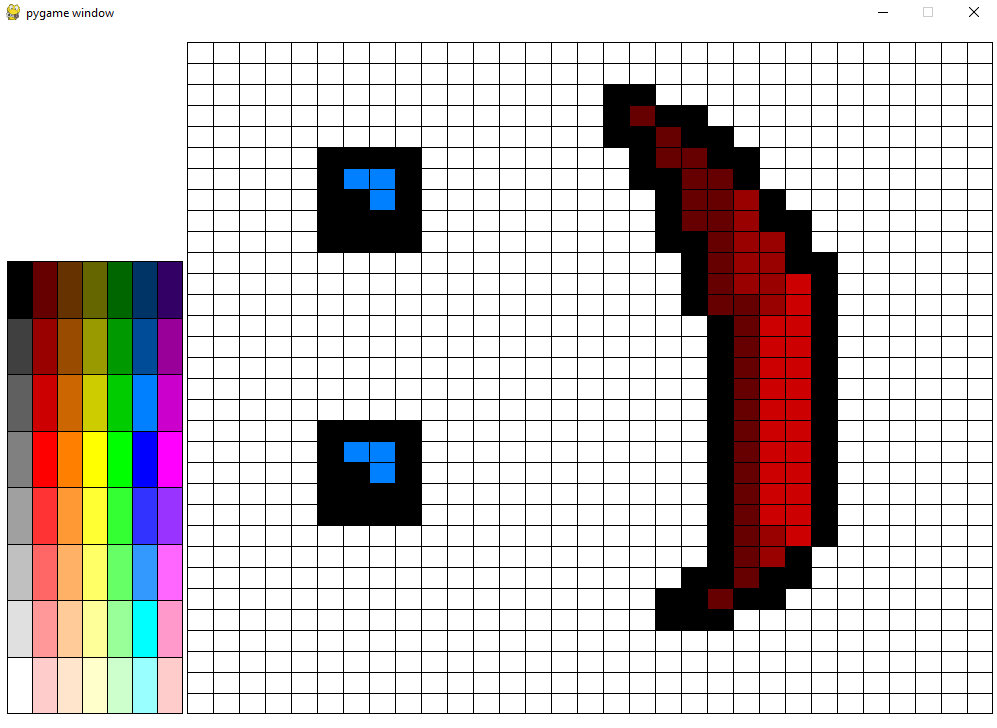

# Programa de Dibujo en Pygame

## Descripción

Este programa es una sencilla aplicación de dibujo utilizando Pygame. Permite al usuario seleccionar colores desde una paleta y dibujar en un área específica. También incluye funcionalidades como guardar la imagen, limpiar el lienzo y habilitar o deshabilitar una rejilla para ayudar con el diseño.

## Características

- Dibujar con diferentes colores seleccionados desde la paleta.
- Limpiar el lienzo con la tecla `C`.
- Guardar la imagen en formato PNG con la tecla `S`.
- Activar la rejilla con la tecla `R` y desactivarla con `P`.
- Dibujo preciso en celdas cuando la rejilla está activada.

## Captura de Pantalla



## Instalación

Asegúrate de tener Python y Pygame instalados. Puedes instalar Pygame con:

```bash
pip install pygame
```

## Uso

Ejecuta el programa con el siguiente comando:

```bash
python Paint.py
```

Controles:

- `C` → Limpiar lienzo
- `S` → Guardar imagen
- `R` → Activar rejilla
- `P` → Desactivar rejilla
- Clic izquierdo → Dibujar

## Despliegue web

Instalar la librería pygbag y ejecutar el comando para construir el archivo index.html:

```bash
pip install pygbag
pygbag pixel-paint
```

Dentro del directorio `pixel-paint` se creará el archivo index.html junto al .jar de la aplicación en `build/web`.


